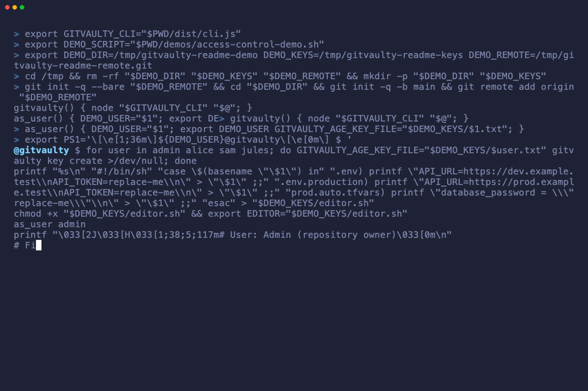

<p align="center">
  
</p>

<h1 align="center">gitvaulty</h1>

<p align="center">
  <strong>Git-backed secret access control for teams and agents.</strong>
</p>

<p align="center">
  Open source. No hosting required.
</p>

GitVaulty encrypts complete files with SOPS and age so they can live safely in Git. Filenames,
contents, comments, formatting, and file types are preserved when decrypted; the committed
`*.gitvaulty` file reveals none of the plaintext structure.

Access is assigned to groups per file, with direct user grants available for exceptions. Every
person keeps one private GitVaulty master identity; there is no shared team decryption key.

GitVaulty is available through its official Homebrew tap and on
[npm](https://www.npmjs.com/package/gitvaulty). Homebrew installs the required Node.js runtime;
direct npm installation requires Node.js 20 or newer.



*A real CLI walkthrough from encrypted-file basics to group-based access control.*

## Contents

1. [Getting started](#getting-started)
   1. [Install GitVaulty](#install-gitvaulty)
   2. [Quick start](#quick-start)
   3. [Add a new developer](#add-a-new-developer)
   4. [Install in a project](#install-in-a-project)
2. [Working with encrypted files](#working-with-encrypted-files)
   1. [Common workflows](#common-workflows)
   2. [Migrate an existing file](#migrate-an-existing-file)
   3. [Create a new file](#create-a-new-file)
   4. [Edit encrypted files](#edit)
   5. [Streaming decrypted bytes](#streaming-decrypted-bytes)
   6. [Local development](#local-development)
   7. [Ephemeral files while running a command](#ephemeral-files-while-running-a-command)
3. [Access control](#access-control)
   1. [Keys, users, and groups](#keys-users-and-groups)
   2. [Create and use access groups](#create-and-use-a-narrower-access-group)
   3. [Change file access](#change-who-can-access-an-existing-file)
   4. [Inspect users and groups](#inspect-users-and-groups)
   5. [Offboard a developer](#offboard-a-developer)
4. [Editors and integrations](#editors-and-integrations)
   1. [VS Code](#vs-code)
   2. [JetBrains IDEs](#jetbrains-ides)
   3. [Agent skill updates](#agent-skill-updates)
5. [Reference](#reference)
   1. [Command reference](#command-reference)
   2. [Supported files](#supported-files)
   3. [Repository layout](#repository-layout)
   4. [Troubleshooting](#troubleshooting)
6. [About](#about)
   1. [Comparisons](#comparisons)
   2. [License](#license)

## Getting started

### Install GitVaulty

On macOS, install GitVaulty from the official Homebrew tap:

```sh
brew install divB0/tap/gitvaulty
```

Homebrew is the recommended macOS installation and also works with Homebrew on Linux. Upgrade with
`brew upgrade gitvaulty`.

For Node.js projects, Windows, and CI, install from npm or run a pinned version with `npx`:

```sh
npm install --global gitvaulty
npx gitvaulty@latest --version
```

### Quick start

Run GitVaulty inside an existing Git repository. Repository commands prepare GitVaulty
automatically, so the first command can create a secret directly:

```sh
npx gitvaulty create .env
```

If your global key is missing, GitVaulty offers to restore an existing backup with masked input or
create a new key. It then creates a `team` group with you as its manager and first member, the public
identity registry, repository preferences, SOPS configuration, and managed repository agent skill
before continuing the requested command. New and imported files use `team` by default, so the normal
workflow needs no access flags.

You can run the same preparation explicitly and idempotently before other work:

```sh
npx gitvaulty init
```

GitVaulty opens a private temporary `.env` in your editor and stores its contents as
`.env.gitvaulty`; it never creates a repository plaintext file. Save the file, close the editor,
and commit the encrypted project state:

```sh
git add .gitvaulty .sops.yaml .agents .env.gitvaulty
git commit -m "chore: initialize GitVaulty"
```

Never commit the plaintext `.env`. If the plaintext already exists, use
`npx gitvaulty import .env` instead of `create`.

While `agentSkill.mode` is `managed`, GitVaulty automatically installs or updates
`.agents/skills/gitvaulty/SKILL.md` from the currently installed CLI. Compatible coding agents can
discover this repository-scoped skill and learn to use `gitvaulty run` with only the files required
for a task, without placing secret values in prompts or command arguments. Set the repository mode
to `disabled` before maintaining custom skill instructions.

### Add a new developer

On their own branch, the new developer registers their public identity without receiving access:

```sh
npx gitvaulty user register
git add .gitvaulty/recipients.json
git commit -m "chore: register alice's GitVaulty key"
```

The command prompts for the repository username, defaults to the current system `$USER`, and lets
the developer accept or replace it. For automation, pass `--username alice`. It creates one private
GitVaulty master identity when needed, but commits only its public age recipient and Ed25519
verification key. Alice opens a pull request with that commit. Her private
`GITVAULTY-IDENTITY-...` backup must never be shared or committed.

After reviewing Alice's registration, a manager of the default group checks out the commit and adds
her to it:

```sh
npx gitvaulty group add team alice
git add .gitvaulty/recipients.json .sops.yaml
git add -u -- '*.gitvaulty'
git commit -m "chore: grant alice team access"
```

`group add` appends a manager-signed policy revision and re-encrypts every affected file for the
updated group. Alice can decrypt those files after the access commit is merged and pulled. The
public-key commit and access-grant commit are separate so a current manager explicitly approves
access.

### Install in a project

Install GitVaulty as a development dependency so everyone working on the project uses the same
version:

```sh
npm install --save-dev gitvaulty
```

Run the project's installed version with `npx`:

```sh
npx gitvaulty <command>
```

For example:

```sh
npx gitvaulty init
npx gitvaulty run --all -- npm start
```

## Working with encrypted files

### Common workflows

#### Import an existing plaintext file

```sh
npx gitvaulty import .env
git add .env.gitvaulty .gitvaulty/recipients.json .sops.yaml
git commit -m "chore: encrypt development environment"
```

The plaintext remains available only in the current clone and is added to Git's clone-local exclude
file. If it was already tracked, rotate its secrets even if you later remove it from Git history.

#### Create another encrypted file

```sh
npx gitvaulty create config/secrets.yaml
git add config/secrets.yaml.gitvaulty .gitvaulty/recipients.json .sops.yaml
git commit -m "chore: add encrypted service configuration"
```

Use `create` when the plaintext path does not exist and `import` when it does.

#### Edit an encrypted file

```sh
npx gitvaulty edit config/secrets.yaml
git add config/secrets.yaml.gitvaulty
git commit -m "chore: update service configuration"
```

Always pass the logical plaintext path, without the `.gitvaulty` suffix.

#### Materialize files for local development

```sh
npx gitvaulty materialize -f .env -f config/secrets.yaml
npx gitvaulty status
npx gitvaulty clean
```

`materialize` creates private local plaintext copies. `clean` removes only unchanged copies that
still match their ciphertext.

#### Review local plaintext changes

```sh
npx gitvaulty diff
npx gitvaulty diff .env config/secrets.yaml
```

`diff` compares decrypted encrypted sources with local plaintext files and prints unified Git-style
output. The output intentionally contains plaintext secret values. Like `git diff`, differences
exit successfully by default; use `--exit-code` when a difference should exit with status 1.

#### Pipe a file without materializing it

```sh
npx gitvaulty cat config/secrets.json | jq .
```

`cat` writes the exact decrypted bytes to stdout and creates no plaintext file. It refuses to print
directly to an interactive terminal unless `--force` is supplied.

#### Expose files only while a command runs

```sh
npx gitvaulty run -f .env -- npm start
```

Use `--all` instead of repeatable `--file` options when the command needs every file you can access.
GitVaulty removes unchanged plaintext files created by that invocation when the command exits.

### Migrate an existing file

If `.env` already exists, import it:

```sh
npx gitvaulty import .env
```

GitVaulty creates `.env.gitvaulty`, decrypts it again to verify an exact byte-for-byte match, and
keeps the original `.env` available locally. It also adds `.env` to the clone-local Git exclude
file. Commit `.env.gitvaulty`, not `.env`.

If the plaintext file is tracked, GitVaulty warns that its secrets may already exist in Git history
and asks before continuing:

```text
.env is tracked by Git and may already exist in Git history.
Rotate any exposed credentials even if you continue.
? Stop tracking .env and continue importing? (y/N)
```

Accepting preserves the local plaintext file, adds it to the clone-local Git exclude file, and
removes it from Git's index with `git rm --cached`. If the file was already committed, its deletion
is staged alongside the new encrypted file. Declining makes no import or index changes.

This does not erase the plaintext from existing commits or other clones. Rewriting shared Git
history is a separate, disruptive repository operation; rotate every credential that may have been
exposed regardless of whether you later rewrite that history.

### Create a new file

If the plaintext file does not exist:

```sh
npx gitvaulty create config/secrets.yaml
```

GitVaulty creates `config/secrets.yaml.gitvaulty` and opens a temporary plaintext copy in
`$VISUAL`, `$EDITOR`, or the platform's default editor. Save an ordinary file—there are no special
markers and no values to label as secrets. The entire file is encrypted when the editor closes.

`create` never imports an existing file. Use `import` explicitly for migration.

Choose a narrower group while creating or importing when needed:

```sh
npx gitvaulty create .env.production --group production
npx gitvaulty import service-account.json --group platform --user alice
```

`--group` and `--user` may be repeated. Direct users are intended for exceptions; groups are the
primary access model.

<a id="edit"></a>

### Edit encrypted files

Always use the logical plaintext path:

```sh
npx gitvaulty edit .env
npx gitvaulty edit config/secrets.yaml
```

GitVaulty decrypts the file into a private temporary directory, opens the normal filename for
editor syntax highlighting, encrypts changed bytes atomically, and removes the temporary directory.
The directory is created below the operating system's standard temporary location (for example,
`/tmp` on many Linux systems or `%TEMP%` on Windows) with a name such as
`gitvaulty-edit-Ab12Cd`.

While the editor is open, GitVaulty holds a process-owned localhost lock for that directory. On a
normal exit, the plaintext directory is removed immediately. A crash, power loss, or `SIGKILL` can
prevent that immediate removal, so every later GitVaulty command also checks for abandoned edit
directories. An unlocked directory must be at least five minutes old before it is removed; a
responding lock always wins and never expires merely because the edit has been open for a long
time.

Startup cleanup is deliberately conservative. It considers only exact `gitvaulty-edit-*` direct
children owned by the current user, with private directory and lock-file permissions and valid lock
metadata. Symlinks, malformed locks, unusual permissions, and unrelated temporary files are left
untouched. Cleanup failures never prevent the requested GitVaulty command from running.

If a matching plaintext file is already materialized, GitVaulty updates it too. If that file has
independent local changes, GitVaulty asks what to do:

```text
.env has local changes

› Use local changes, then edit
  Discard local changes, then edit
  Cancel
```

For scripts, make local changes authoritative explicitly:

```sh
npx gitvaulty import --update .env
```

The updated encrypted file is decrypted and verified before replacing the previous version.

### Streaming decrypted bytes

Use `cat` when the receiving tool accepts standard input and does not need a native file path:

```sh
npx gitvaulty cat config/credentials.json | jq .
npx gitvaulty cat manifests/secret.yaml | kubectl apply -f -
```

GitVaulty writes only the exact decrypted bytes to stdout. Errors stay on stderr, and no plaintext
file is created. Direct output to an interactive terminal is refused unless `--force` is supplied.
See the [`cat` command reference](docs/commands/cat.md) for the output and safety contract.

### Local development

Materialize every file you can access:

```sh
npx gitvaulty materialize
```

Or select files by their plaintext paths:

```sh
npx gitvaulty materialize -f .env -f config/secrets.yaml
```

Materialized files receive mode `0600`. Existing files are accepted only when their bytes match the
encrypted source. Differing, symlinked, unsafe, or Git-tracked destinations are never overwritten.

Inspect their state:

```sh
npx gitvaulty status
```

```text
current  .env
missing  config/secrets.yaml
modified terraform/secrets.auto.tfvars.json
```

Remove materialized files when you no longer need them:

```sh
npx gitvaulty clean
```

`clean` removes only regular, untracked files whose bytes still match GitVaulty. Modified or unsafe
files are reported and kept.

### Ephemeral files while running a command

`run` materializes missing files, starts the command, and removes only the unchanged files that
this invocation created:

```sh
npx gitvaulty run --all -- npm start
```

`run` requires an explicit scope. Use `--all` for every file the current identity may access, or
repeat `--file` to expose only the files the command needs:

```sh
npx gitvaulty run -f .env.production -- npm start

npx gitvaulty run \
  -f terraform/secrets.auto.tfvars.json \
  -- terraform -chdir=terraform plan
```

GitVaulty materializes files; it does not interpret them or inject their contents as environment
variables. Applications and tools continue loading their native files normally. For plain Node.js:

```json
{
  "scripts": {
    "start": "node --env-file=.env src/server.js"
  }
}
```

If the child modifies a file created by `run`, GitVaulty keeps it and prints a warning. Existing
matching files are never owned or removed by `run`. Cleanup also runs after nonzero exits and common
termination signals; an uncatchable crash, power loss, or `SIGKILL` can still leave plaintext behind.

Private-key variables are available to SOPS but removed from the child process environment.

The skill offered by `gitvaulty init` teaches coding agents this workflow and warns them not to
print, log, or inspect secret values unnecessarily. Agent instructions reduce accidental exposure;
they are not a security sandbox. Use the agent harness or operating-system isolation when an agent
must be technically prevented from reading plaintext available to its process.

## Access control

### Keys, users, and groups

```sh
npx gitvaulty key create
npx gitvaulty key public
npx gitvaulty key backup
npx gitvaulty key restore
npx gitvaulty user register
npx gitvaulty user add
npx gitvaulty user list
npx gitvaulty user remove
npx gitvaulty group create production
npx gitvaulty group add production alice
npx gitvaulty group remove production alice
npx gitvaulty group manager add production alice
npx gitvaulty group manager remove production alice
npx gitvaulty group list
npx gitvaulty group delete production
```

The global GitVaulty master identity normally lives at `~/.config/gitvaulty/identity`. Back it
up once with `gitvaulty key backup`; the same identity works across GitVaulty repositories. Native
age/X25519 and Ed25519 keys are derived in memory for each command and are never cached on disk.

GitVaulty 2.0 uses the extensionless `identity` path exclusively. Before upgrading from 1.x, rename
`~/.config/gitvaulty/identity.txt` to `~/.config/gitvaulty/identity` if the extensionless file does
not already exist. Moving the same master identity does not change its public keys or require
re-encrypting existing files. See [`gitvaulty key`](docs/commands/key.md#upgrade-from-1x) for Windows
instructions and conflict guidance.

The interactive backup command can save the identity to a detected 1Password or Bitwarden CLI,
copy it to the desktop clipboard, or print it after an additional warning. The password-manager
picker keeps supported but unavailable CLIs selectable so it can show installation instructions and
check again without restarting. For scripts, choose the destination explicitly:

```sh
npx gitvaulty key backup --clipboard
npx gitvaulty key backup --print
```

`--clipboard` and `--print` are mutually exclusive. Clipboard history and synchronization tools may
retain copied keys; direct password-manager storage is preferred.

A new developer runs `gitvaulty user register`, confirms the suggested system username, and commits
both public keys with no access. Scripts can use `gitvaulty user register --username <username>`.
An existing group manager reviews that commit and runs
`gitvaulty group add <group> <username>` to approve access. `user add` remains available as an
interactive shortcut when a manager already has someone else's public identity.
Private keys are never shared.

Change the policy of an existing file with one interactive command:

```sh
npx gitvaulty access .env.production
```

GitVaulty shows group grants first and direct-user exceptions second. For automation, set the exact
policy with repeatable flags:

```sh
npx gitvaulty access .env.production --group production --group platform --user alice
```

Only a current group manager can add or remove members or promote or demote managers. Every manager
is also a member and can read the group's secrets. Each change appends a signed, revision-linked
policy and automatically re-encrypts every affected file for its new exact recipient set. A group
cannot be deleted while a file uses it, and the default `team` group cannot be deleted.

The first policy revision is trusted through Git history. Protect the default branch and review
changes to `.gitvaulty/recipients.json`; cryptography detects edits within the accepted policy chain,
while Git review prevents an attacker from replacing that chain with a different genesis policy.

Removing a user rotates every affected file's data key and removes that recipient. It cannot erase
Git history or plaintext the user previously copied, so rotate external credentials after
offboarding.

CI and service accounts can inject a separate private identity:

```sh
GITVAULTY_KEY='GITVAULTY-IDENTITY-...' npx gitvaulty run --all -- npm start
```

Mounted master identities use `GITVAULTY_AGE_KEY_FILE=/secure/identity.txt`. GitVaulty 3.0 no
longer accepts `SOPS_AGE_KEY_FILE` as a master-identity source; rename that environment variable to
`GITVAULTY_AGE_KEY_FILE` before upgrading. The referenced identity file and encrypted files do not
change. GitVaulty derives and passes the native age identity to SOPS internally.

### Create and use a narrower access group

```sh
npx gitvaulty group create production
npx gitvaulty group add production alice
npx gitvaulty create .env.production --group production
```

Commit `.gitvaulty/recipients.json`, `.sops.yaml`, and every ciphertext changed by the membership or
file-policy update.

### Change who can access an existing file

```sh
npx gitvaulty access .env.production
```

The interactive command selects groups first and direct-user exceptions second. For automation,
replace the complete policy explicitly:

```sh
npx gitvaulty access .env.production --group production --user alice
```

### Inspect users and groups

```sh
npx gitvaulty user list
npx gitvaulty group list
```

Run `npx gitvaulty access <path>` without flags to inspect and interactively update one file's
policy.

### Offboard a developer

```sh
npx gitvaulty user remove
git add .gitvaulty/recipients.json .sops.yaml
git add -u -- '*.gitvaulty'
git commit -m "chore: revoke GitVaulty access"
```

Removing a user re-encrypts affected files without their recipient. It cannot revoke plaintext or
historical ciphertext they already copied, so rotate every external credential they knew.

## Editors and integrations

### VS Code

[Install GitVaulty from the Visual Studio Marketplace](https://marketplace.visualstudio.com/items?itemName=divB0.gitvaulty),
search for **GitVaulty** in VS Code's Extensions view, or run:

```sh
code --install-extension divb0.gitvaulty
```

The Marketplace provides native packages for macOS (Apple Silicon and Intel), Linux (ARM64 and
x64), and Windows x64.

To edit an encrypted file:

1. Open the local GitVaulty repository as a trusted VS Code workspace.
2. Select a `*.gitvaulty` file in the Explorer.
3. Edit the decrypted virtual document normally.
4. Save or use Auto Save to re-encrypt, verify, and atomically replace the ciphertext.

The virtual document keeps the plaintext filename for syntax highlighting and compatible language
features. GitVaulty does not materialize a plaintext repository file.

The extension detects ciphertext changes and refuses to overwrite a newer encrypted version. Native
editing means decrypted text is visible to VS Code, compatible extensions and language servers, and
possibly VS Code's private Hot Exit recovery storage. Use `gitvaulty edit` when that security boundary
is not appropriate.

See the [full VS Code guide](docs/vscode.md) for setup, commands, conflict handling, security details,
and troubleshooting.

### JetBrains IDEs

[Install GitVaulty from JetBrains Marketplace](https://plugins.jetbrains.com/plugin/33659-gitvaulty),
or open **Settings | Plugins | Marketplace** in a compatible IDE, search for **GitVaulty**, and
select **Install**.

GitVaulty's JetBrains plugin opens `*.gitvaulty` files as decrypted native editor documents in
IntelliJ IDEA and other desktop JetBrains IDEs. Saving re-encrypts, verifies, and atomically replaces
the ciphertext without creating a plaintext sibling in the repository.

The plugin supports macOS (Apple Silicon and Intel), Linux (ARM64 and x64), and Windows x64. It
downloads a native GitVaulty runtime for the current platform from an exact GitHub Release asset,
then verifies both its byte length and SHA-256 digest before installation.

The editor detects ciphertext changes and refuses to overwrite a newer encrypted version. Decrypted
text is visible to the IDE document model, compatible plugins and language services, and potentially
IDE recovery storage. Use `gitvaulty edit` when that security boundary is not appropriate.

See the [JetBrains plugin guide](jetbrains/README.md) for installation, editor actions, conflict
handling, security details, development, and release packaging.

### Agent skill updates

Before every repository command, GitVaulty compares
`.agents/skills/gitvaulty/SKILL.md` with the skill bundled in the installed GitVaulty package. It
uses a SHA-256 digest of normalized text, so normal LF and CRLF line-ending differences do not look
like updates. The check runs after any required implicit initialization. Global `key` commands,
help, and version output do not inspect repository skill state.

In the default `managed` mode, a missing skill is installed and differing content is replaced
automatically, including during non-interactive and CI commands. Installation and update notices go
to stderr so command output remains composable.

The repository-wide policy is stored in `.gitvaulty/config.yaml`:

```yaml
version: 1
agentSkill:
  mode: managed
```

Set `mode: disabled` before adding local customizations to leave the skill untouched for every
contributor. Commit the configuration change.

## Reference

### Command reference

#### Files and workflows

| Command | Purpose |
| --- | --- |
| [`gitvaulty init`](docs/commands/init.md) | Explicitly prepare or repair GitVaulty repository state. |
| [`gitvaulty create`](docs/commands/create.md) | Create and edit a new encrypted file. |
| [`gitvaulty import`](docs/commands/import.md) | Encrypt an existing plaintext file or update existing ciphertext. |
| [`gitvaulty access`](docs/commands/access.md) | Replace a file's group and direct-user access policy. |
| [`gitvaulty edit`](docs/commands/edit.md) | Edit a file through a private temporary plaintext copy. |
| [`gitvaulty cat`](docs/commands/cat.md) | Stream one decrypted file to standard output without materializing it. |
| [`gitvaulty diff`](docs/commands/diff.md) | Show Git-style plaintext changes relative to encrypted sources. |
| [`gitvaulty materialize`](docs/commands/materialize.md) | Create persistent local plaintext copies. |
| [`gitvaulty clean`](docs/commands/clean.md) | Remove unchanged materialized plaintext files. |
| [`gitvaulty status`](docs/commands/status.md) | Compare local plaintext with encrypted sources. |
| [`gitvaulty run`](docs/commands/run.md) | Materialize files while a child command runs. |

#### Identity and access commands

- [`gitvaulty key`](docs/commands/key.md) — Manage your global master identity:
  [`create`](docs/commands/key-create.md),
  [`public`](docs/commands/key-public.md),
  [`backup`](docs/commands/key-backup.md), and
  [`restore`](docs/commands/key-restore.md).
- [`gitvaulty user`](docs/commands/user.md) — Manage registered repository users:
  [`register`](docs/commands/user-register.md),
  [`add`](docs/commands/user-add.md),
  [`list`](docs/commands/user-list.md), and
  [`remove`](docs/commands/user-remove.md).
- [`gitvaulty group`](docs/commands/group.md) — Manage access groups:
  [`create`](docs/commands/group-create.md),
  [`add`](docs/commands/group-add.md),
  [`remove`](docs/commands/group-remove.md),
  [`manager`](docs/commands/group-manager.md),
  [`list`](docs/commands/group-list.md), and
  [`delete`](docs/commands/group-delete.md).

### Supported files

Whole-file encryption works with any regular file:

```text
.env.gitvaulty                          -> .env
config/secrets.yaml.gitvaulty           -> config/secrets.yaml
terraform/prod.tfvars.json.gitvaulty    -> terraform/prod.tfvars.json
certs/client.pem.gitvaulty              -> certs/client.pem
```

The `.gitvaulty` suffix is the only storage convention. All commands accept the path on the right,
without the suffix.

Because the complete byte stream is opaque, Git does not reveal keys or document structure. The
tradeoff is that Git cannot merge concurrent edits to the same encrypted file meaningfully; keep
files small and split unrelated secrets into separate files when different people edit them.

### Repository layout

```text
.gitvaulty/config.yaml                        # repository-wide GitVaulty preferences
.gitvaulty/recipients.json                    # public users, groups, and per-file access
.sops.yaml                                    # generated public SOPS rules
.agents/skills/gitvaulty/SKILL.md             # safe GitVaulty workflow for coding agents
.env.gitvaulty                                # opaque encrypted .env bytes
terraform/prod.tfvars.json.gitvaulty          # opaque encrypted Terraform bytes
```

### Troubleshooting

#### `npx` reports `uv_cwd`

`npx` asks npm to read the current working directory before GitVaulty starts. If that directory was
removed, or the operating system no longer permits access to it, npm can exit with
`process.cwd failed` and `uv_cwd`. Move to an accessible directory and rerun the command:

```sh
cd ~
npx gitvaulty key backup
```

Global key commands do not need to run inside a Git repository. If the error persists from an
accessible directory, check that the terminal has permission to access that directory.

## About

### Comparisons

Evaluating repository and environment-secret tools?

- [GitVaulty compared with Agebox](https://github.com/divB0/gitvaulty/blob/main/docs/comparisons/agebox.md)
- [GitVaulty compared with Cottage](https://github.com/divB0/gitvaulty/blob/main/docs/comparisons/cottage.md)
- [GitVaulty compared with dotenvx](https://github.com/divB0/gitvaulty/blob/main/docs/comparisons/dotenvx.md)

### License

MIT
